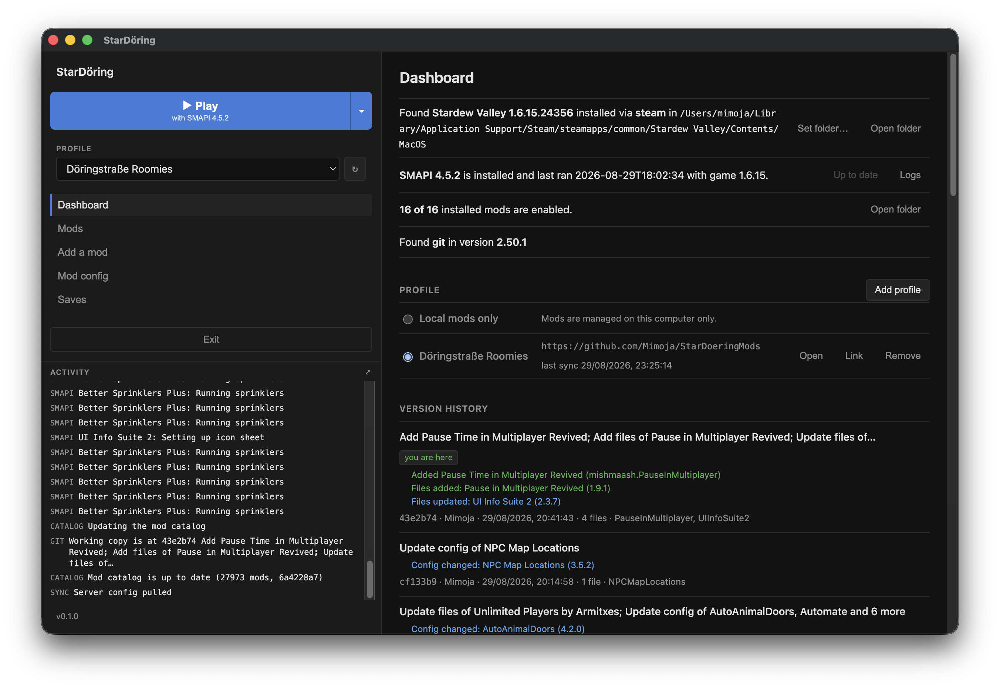

# StarDöring

Stardew Valley launcher + mod manager that sync your mods via a git repo




## Installation
- Install git
- [Releases](https://github.com/Mimoja/StarDoering/releases): `.dmg`/`.zip` (macOS arm64 + x64), `.exe` (Windows installer + portable), `.AppImage`/`.deb` (Linux x64 + arm64, Deck-ready). 

## Setup

1. Dashboard → **Add profile** and paste a git repo URL. Empty branches / repos will be initialized
2. Add mods
3. Push changes
4. Have others pull the changes

## Dev

```bash
npm install
npm run dev        # electron-vite + hot reload
npm run typecheck  # tsc, both halves
npm run dist       # electron-builder → dist/  (Windows: electronuserland/builder:wine in Docker)
```

## License

GPL-3.0-or-later – see [LICENSE](LICENSE).
